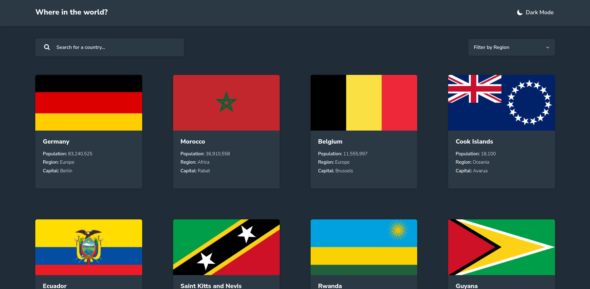

# Frontend Mentor - Launch countdown timer solution

This is a solution to the [REST Countries API with color theme switcher challenge on Frontend Mentor](https://www.frontendmentor.io/challenges/rest-countries-api-with-color-theme-switcher-5cacc469fec04111f7b848ca).

## Content

- [Overview](#overview)
  - [The challenge](#the-challenge)
  - [Screenshot](#screenshot)
  - [Links](#links)
- [My process](#my-process)
  - [Built with](#built-with)
- [Author](#author)

## Overview

### The challenge

Users should be able to:

- See all countries from the API on the homepage
- Search for a country using an `input` field
- Filter countries by region
- Click on a country to see more detailed information on a separate page
- Click through to the border countries on the detail page
- Toggle the color scheme between light and dark mode *(optional)*

### Screenshot

### Links

- Solution URL: [Frontend Mentor]()
- Live Site URL: [Vercel]()

## My process

### Built with

- Flexbox
- CSS Grid
- Mobile-first workflow
- [React](https://es.reactjs.org/) - JS library
- [Vite](https://vitejs.dev/) - Frontend tooling
- [SASS](https://sass-lang.com/) - For styles

## Author

- Linkedin - [Gustavo Rentería](https://www.linkedin.com/in/gustavo-renter%C3%ADa-2b7819218/)
